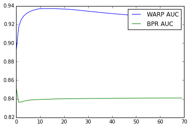
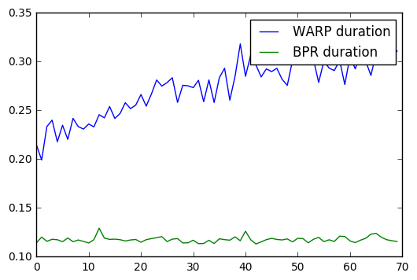
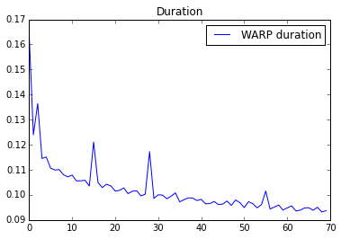
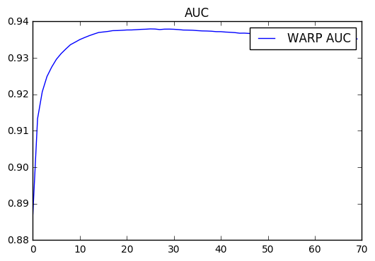

Learning-to-rank using the WARP loss
====================================

LightFM is probably the only recommender package implementing the WARP
(Weighted Approximate-Rank Pairwise) loss for implicit feedback
learning-to-rank. Generally, it perfoms better than the more popular BPR
(Bayesian Personalised Ranking) loss --- often by a large margin.

It was originally applied to image annotations in the Weston et al.
`WSABIE
paper <http://www.thespermwhale.com/jaseweston/papers/wsabie-ijcai.pdf>`__,
but has been extended to apply to recommendation settings in the `2013
k-order statistic loss
paper <http://www.ee.columbia.edu/~ronw/pubs/recsys2013-kaos.pdf>`__ in
the form of the k-OS WARP loss, also implemented in LightFM.

Like the BPR model, WARP deals with (user, positive item, negative item)
triplets. Unlike BPR, the negative items in the triplet are not chosen
by random sampling: they are chosen from among those negatie items which
would violate the desired item ranking given the state of the model.
This approximates a form of active learning where the model selects
those triplets that it cannot currently rank correctly.

This procedure yields roughly the following algorithm:

1. For a given (user, positive item pair), sample a negative item at
   random from all the remaining items. Compute predictions for both
   items; if the negative item's prediction exceeds that of the positive
   item plus a margin, perform a gradient update to rank the positive
   item higher and the negative item lower. If there is no rank
   violation, continue sampling negative items until a violation is
   found.
2. If you found a violating negative example at the first try, make a
   large gradient update: this indicates that a lot of negative items
   are ranked higher than positives items given the current state of the
   model, and the model must be updated by a large amount. If it took a
   lot of sampling to find a violating example, perform a small update:
   the model is likely close to the optimum and should be updated at a
   low rate.

While this is fairly hand-wavy, it should give the correct intuition.
For more details, read the paper itself or a more in-depth blog post
`here <https://building-babylon.net/2016/03/18/warp-loss-for-implicit-feedback-recommendation/>`__.
A similar approach for BPR is described in Rendle's 2014 `WSDM 2014
paper <http://webia.lip6.fr/~gallinar/gallinari/uploads/Teaching/WSDM2014-rendle.pdf>`__.

Having covered the theory, the rest of this example looks at the
practical implications of using WARP in LightFM.

Preliminaries
-------------

Let's first get the data. We'll use the MovieLens 100K dataset.

.. code:: python

    import time
    
    import numpy as np
    
    %matplotlib inline
    
    import matplotlib
    import numpy as np
    import matplotlib.pyplot as plt
    
    from lightfm import LightFM
    from lightfm.datasets import fetch_movielens
    from lightfm.evaluation import auc_score
    
    movielens = fetch_movielens()
    
    train, test = movielens['train'], movielens['test']

Accuracy
--------

The first interesting experiment is to compare the accuracy between the
WARP and BPR losses. Let's fit two models with equivalent
hyperparameters and compare their accuracy across epochs. Whilst we're
fitting them, let's also measure how much time each epoch takes.

.. code:: python

    alpha = 1e-05
    epochs = 70
    num_components = 32
    
    warp_model = LightFM(no_components=num_components,
                        loss='warp',
                        learning_schedule='adagrad',
                        max_sampled=100,
                        user_alpha=alpha,
                        item_alpha=alpha)
    
    bpr_model = LightFM(no_components=num_components,
                        loss='bpr',
                        learning_schedule='adagrad',
                        user_alpha=alpha,
                        item_alpha=alpha)
    
    warp_duration = []
    bpr_duration = []
    warp_auc = []
    bpr_auc = []
    
    for epoch in range(epochs):
        start = time.time()
        warp_model.fit_partial(train, epochs=1)
        warp_duration.append(time.time() - start)
        warp_auc.append(auc_score(warp_model, test, train_interactions=train).mean())
        
    for epoch in range(epochs):
        start = time.time()
        bpr_model.fit_partial(train, epochs=1)
        bpr_duration.append(time.time() - start)
        bpr_auc.append(auc_score(bpr_model, test, train_interactions=train).mean())

Plotting the results immediately reveals that WARP produces superior
results: a smarter way of selecting negative examples leads to higher
quality rankings. Test accuracy decreases after the first 10 epochs,
suggesting WARP starts overfitting and would benefit from regularization
or early stopping.

.. code:: python

    x = np.arange(epochs)
    plt.plot(x, np.array(warp_auc))
    plt.plot(x, np.array(bpr_auc))
    plt.legend(['WARP AUC', 'BPR AUC'], loc='upper right')
    plt.show()

Fitting speed
-------------

What about model fitting speed?

.. code:: python

    x = np.arange(epochs)
    plt.plot(x, np.array(warp_duration))
    plt.plot(x, np.array(bpr_duration))
    plt.legend(['WARP duration', 'BPR duration'], loc='upper right')
    plt.show()

WARP is slower than BPR for all epochs. Interestingly, however, it gets
slower with additional epochs; every subsequent epoch takes more time.
This is because of WARP's adaptive samling of negatives: the closer the
model fits the training data, the more times it needs to sample in order
to find rank-violating examples, leading to longer fitting times.

For this reason, LightFM exposes the ``max_sampled`` hyperparameter that
limits the number of attemps WARP will carry out to find a negative.
Setting it to a low value and repeating the run shows that the run time
actually decreases with every epoch: this is because no updates happen
when a violating example cannot be found in the specified number of
attempts.

.. code:: python

    warp_model = LightFM(no_components=num_components,
                         max_sampled=3,
                        loss='warp',
                        learning_schedule='adagrad',
                        user_alpha=alpha,
                        item_alpha=alpha)
    
    warp_duration = []
    warp_auc = []
    
    for epoch in range(epochs):
        start = time.time()
        warp_model.fit_partial(train, epochs=1)
        warp_duration.append(time.time() - start)
        warp_auc.append(auc_score(warp_model, test, train_interactions=train).mean())
    
    x = np.arange(epochs)
    plt.plot(x, np.array(warp_duration))
    plt.legend(['WARP duration'], loc='upper right')
    plt.title('Duration')
    plt.show()
    
    x = np.arange(epochs)
    plt.plot(x, np.array(warp_auc))
    plt.legend(['WARP AUC'], loc='upper right')
    plt.title('AUC')
    plt.show()

